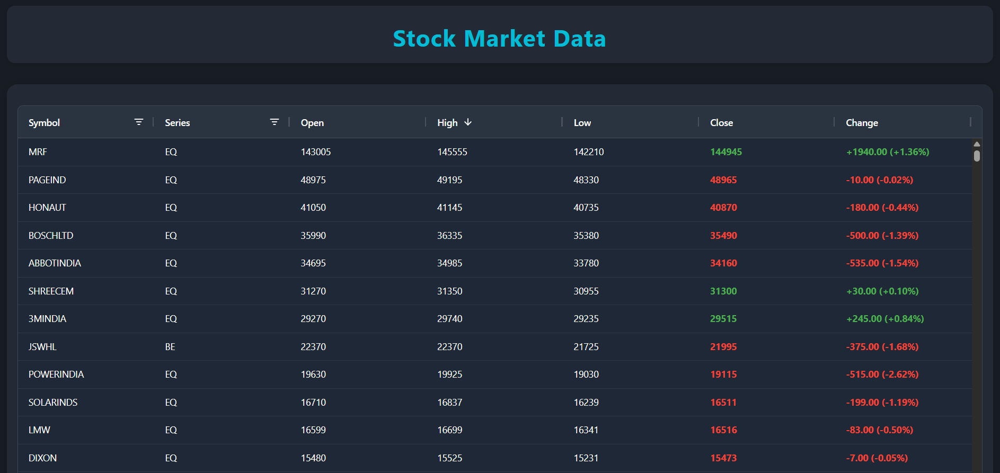

# Stock Dashboard Angular

This project is a modern, nightly-updated stock market dashboard built with Angular, designed to showcase advanced frontend and cloud skills for portfolio purposes.

- **Live Demo:** [https://stockdashboard-dea1d.web.app/](https://stockdashboard-dea1d.web.app/)

## Screenshots



## Features

- **Angular 16+** standalone component architecture
- **AG Grid** for high-performance, interactive data tables
  - Filtering, sorting, and analytics columns (e.g., price change and % change)
  - Custom cell coloring for price increases/decreases
  - Status bar with total and filtered row count
- **Dark mode** with custom theming for a professional look
- **Stock data updated nightly** to **Google Firestore** (not real-time)
- **Cloud Function** to parse CSV stock data and save to Firestore
- **Deployed with Firebase Hosting**
- Responsive, modern UI

## How It Works

### 1. Frontend (Angular)
- The dashboard displays stock data in a powerful AG Grid table.
- Features include text filtering, sorting, analytics columns (change and %), and color-coded cells.
- The grid is styled with a custom dark theme and supports nightly-updated data from Firestore.

### 2. Backend (Firestore)
- Stock data is stored in a Firestore collection (e.g., `nse_bhavcopy`).
- The Angular app subscribes to this collection for updates.

### 3. Data Ingestion (Cloud Function)
- A Google Cloud Function is used to parse CSV files containing stock data.
- The function reads the CSV, transforms the data, and writes it to the Firestore collection.
- This enables automated, scalable ingestion of daily stock data (updated nightly).

#### Example Cloud Function (Node.js):
```js
const functions = require('firebase-functions');
const admin = require('firebase-admin');
const csv = require('csv-parser');
const { Storage } = require('@google-cloud/storage');

admin.initializeApp();
const db = admin.firestore();
const storage = new Storage();

exports.parseStockCsv = functions.storage.object().onFinalize(async (object) => {
  const bucket = storage.bucket(object.bucket);
  const file = bucket.file(object.name);
  const stocks = [];

  await new Promise((resolve, reject) => {
    file.createReadStream()
      .pipe(csv())
      .on('data', (row) => stocks.push(row))
      .on('end', resolve)
      .on('error', reject);
  });

  const batch = db.batch();
  stocks.forEach(stock => {
    const docRef = db.collection('nse_bhavcopy').doc(stock.symbol);
    batch.set(docRef, stock);
  });
  await batch.commit();
});
```

## Getting Started

1. **Clone the repo:**
   ```sh
   git clone <repo-url>
   cd stock-dashboard-angular
   ```
2. **Install dependencies:**
   ```sh
   npm install
   ```
3. **Configure Firebase:**
   - Add your Firebase config to `src/environments/environment.ts`.
   - Ensure Firestore and Cloud Functions are enabled in your Firebase project.
4. **Run the app:**
   ```sh
   npm start
   ```
   The app will be available at [http://localhost:4200](http://localhost:4200)

## Deployment

This project is deployed using **Firebase Hosting**:

- **Live Demo:** [https://stockdashboard-dea1d.web.app/](https://stockdashboard-dea1d.web.app/)

## Why This Project?

This project demonstrates:
- Advanced Angular and TypeScript skills
- Automated, cloud-based data ingestion and updates
- Cloud automation with Google Cloud Functions
- Modern UI/UX with AG Grid and dark mode

---

**Built for learning purposes.**
